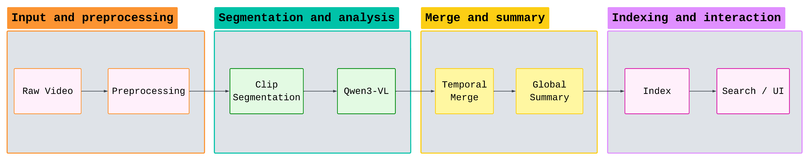
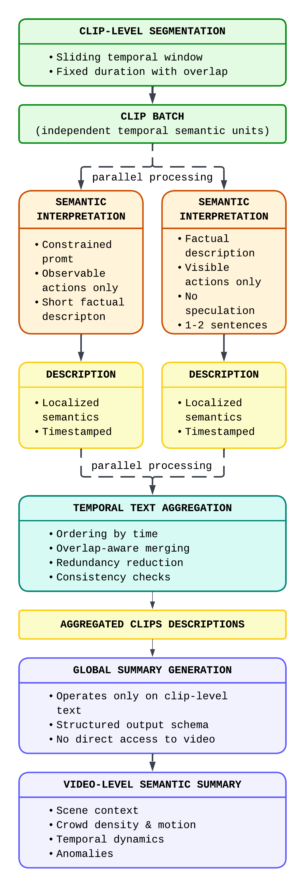

# SmartCampus V2T

**SmartCampus V2T** is a practical, end-to-end **video-to-text analytics system** for long-form CCTV and surveillance footage.
The project focuses on transforming raw video streams into **structured, searchable textual representations** using modern multimodal models and efficient indexing, with a strong emphasis on usability through a Streamlit-based UI.



---

## Overview

The system processes long, untrimmed surveillance videos and converts them into interpretable text that can be explored, searched, and analyzed.
Instead of operating on low-level detections alone, SmartCampus V2T prioritizes **semantic understanding** and **human-readable outputs**.

Core ideas:
- Video understanding expressed directly as text
- Deterministic, inspectable processing stages
- UI-first interaction model for experimentation and analysis

---

## System Architecture

<p align="center">
  
</p>

<p align="center">
  <em>System architecture of the SmartCampus V2T pipeline</em>
</p>

The pipeline is organized into modular components:

- **Preprocessing layer**
  Normalizes FPS, filters redundant or dark frames, applies optional face anonymization, and caches prepared frames.

- **Clip generation**
  Videos are segmented into overlapping temporal windows (clips) suitable for multimodal inference.

- **Video-to-Text inference**
  Each clip is described using Qwen3-VL with concise, factual prompts (RU / KZ / EN).

- **Temporal post-processing**
  Adjacent clips with similar semantics are merged to reduce redundancy.

- **Global summarization**
  A structured summary is generated strictly from clip-level descriptions.

- **Indexing and search**
  Hybrid sparse+dense indexing enables fast semantic retrieval over time intervals.

---

## Repository Structure

```text
```text
smartcampus_v2t/
  .streamlit/
    config.toml               # Streamlit configuration

  app/                        # Streamlit application (main control plane)
    assets/
      logo.png                # UI logo
      styles.css              # Custom UI styles
      ui_text.json            # UI text + i18n (ru/kz/en)
    app.py                    # Streamlit UI entrypoint (Home/Search, processing, index updates)

  configs/
    pipeline.yaml             # Unified configuration (paths, model, clips, search, UI)

  src/                        # Core library (pipeline + search + utils)
    __init__.py

    core/                     # Types + Qwen-VL backend wrapper
      __init__.py
      types.py                # Dataclasses: VideoMeta, FrameInfo, Annotation, RunMetrics, etc.
      qwen_vl_backend.py      # Qwen3-VL backend wrapper (generation, batching, templates)

    preprocessing/            # Video preparation and caching
      __init__.py
      video_io.py             # Preprocessing: frame extraction, caching, metadata

    pipeline/                 # Clip V2T, merging, global summary
      __init__.py
      pipeline_config.py      # Pipeline config schema
      video_to_text.py        # VideoToTextPipeline: clip inference + postprocess + metrics

    search/                   # Index builder and query engine
      __init__.py
      index_builder.py        # Build/update index from run outputs
      query_engine.py         # Hybrid search (BM25 + dense), fusion, dedupe

    utils/
      __init__.py
      config_loader.py        # Load pipeline.yaml → typed config

  data/                       # Runtime data (typically generated locally)
    raw/                      # Unprepared/original videos
    prepared/                 # Prepared frames + preprocessing cache
    runs/                     # Run outputs per video (manifests, annotations, metrics)
    indexes/                  # Search index artifacts (manifest/meta + vectors)
    thumbs/                   # Cached thumbnails for UI carousel

  docs/                       # README figures and user guides
    figures/
       figure1_main.png
       figure2_main.png

  .gitignore
  Dockerfile
  README.md
```

### Run folder layout (`data/runs/<video_id>/run_###/`)

```text
data/runs/<video_id>/run_###/
  run_manifest.json           # Run metadata (language/device, inference_fingerprint, timestamps, status)
  config.json                 # Snapshot of the effective config used for this run
  annotations.json            # Timeline segments: {start_sec, end_sec, description, extra}
  metrics.json                # Timings/counters + extra fields (may include global_summary)
```

---

## Installation & Configuration

### Environment setup

Python 3.10+ is recommended.

```bash
python -m venv .venv
source .venv/bin/activate   # Linux / macOS
# .venv\Scripts\activate  # Windows

pip install -U pip
pip install -r requirements.txt
```

### Configuration

All system parameters are defined in a single file:

```
config/pipeline.yaml
```

This includes:
- Paths for videos, runs, prepared frames, and indexes
- Video preprocessing parameters
- Model and inference settings
- Search and indexing configuration

---
## Running the project

The entire workflow is driven from the Streamlit interface.

```bash
streamlit run app/main.py
```

UI will be opened automatically after running command or you may manually open it by next link:
```
http://localhost:8501
```

From the UI you can:
- Preprocess videos
- Run video-to-text inference
- Inspect runs and metrics
- Build or update indexes
- Perform semantic search over timelines

---
## Component Status

| Component                       | Status              |
|---------------------------------|---------------------|
| Video preprocessing             | Implemented         |
| Clip V2T inference              | Implemented         |
| Temporal merging                | Implemented         |
| Global summary                  | Implemented         |
| Hybrid indexing                 | Implemented         |
| Semantic search                 | Implemented         |
| Streamlit UI                    | Implemented         |
